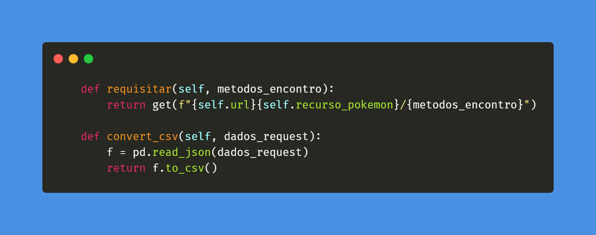

# Pokedex

Esse é o segundo projeto do curso Vamo AI, curso voltado para o backend e inteligência artificial, uma parceria em o Ifood e Redília Educação. 

>Nesse segundo módulo utilizamos conhecimentos adquiridos em Tech e Soft Skills 

 Tech  | Soft Skills
--------- | ------
Utilização de API | Scrum
Módelo MVC | Utilização do método Kanban com o Trello 
Orientção a Objetos | Reuniões diárias "Daily"
Conceitos de Engenharia de software| Comunicação 
Branch's | Divisão de tarefas
Bibliotecas do Python: pandas e requests | Product Backlog e Sprint Backlog | 
Arquivos em json e csv | Fluxograma
códigos de retorno HTTP da API | Apresentação do projeto
---
>### Tudo começa pelo fluxograma

Criamos um fluxograma para estruturar a ideia dentro do modelo MVC e e reaproveitando código.

### PokéApi: Como usamos a APi

### Nesse projeto resolvemos usar a API do Pokémon de forma a consultar possíveis locais onde o jogado pode encontrar os monstrinhos, e como esles vão estar (andando, voando e etc.) Para isso, utilizamos o recurso da encouther-method disponibilizado na documentação da API

            API: https://pokeapi.co/api/v2/pokemon/

### Bibliotecas, arquivos muito mais!
Para conseguir extrair os dados da API utilizamos o request, uma biblioteca do Python
Dentro do modelo MVC (model, view e controller), requisitamos os dados da API em Json e convertemos em CSV. Para converter foi necessário utilizar a biblioteca pandas, e armazenamos os dados das duas formas. 

Um pedacinho do nosso código: 

### GitHub dos Treinadores Pokémon do projeto:

* [Aline](https://github.com/AlinesantosCS)
* [Juliana](https://github.com/Julianajjss)
* [Luzivan](https://github.com/luzivan-lira/JogoResilia-)
* [Mateus](https://github.com/mateusvarelo)
* [Olavo](https://github.com/Olavo5)
